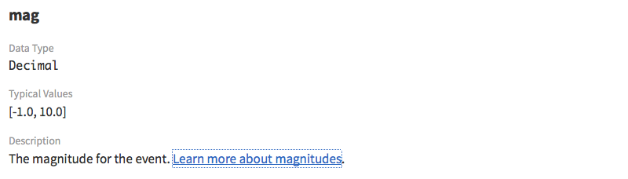
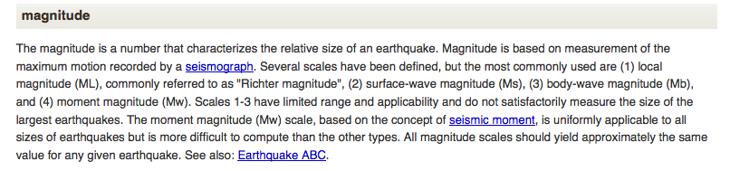

# Metadata: A Love Note to the Future

**Our future users-- and even our future selves, who may eventually forget some of the finer details of our own datasets months or years on-- need well-described, thoroughly documented data sets to ensure proper, responsible use and reuse.**  In the previous example, we saw how baffling a dataset can be when we don’t have access to good metadata about it.

The example data set we looked at was (...big reveal...) sourced from the United States Geographical Survey (USGS), which makes earthquake data available on its website, as downloadable .CSV files (simple text files with values separated by commas), or even as live streams. The downloaded file we saw above was the result of a query to the USGS database for earthquakes detected within a certain time frame-- 24 hours in early May of 2016.

Luckily for us, the USGS has carefully documented their data sets on their web site, and provides a terrific reference [guide to the CSV spreadsheet format](http://earthquake.usgs.gov/earthquakes/feed/v1.0/csv.php), including a glossary of terms to explain the metadata! Here are some example definitions from that glossary:

The magnitude-- the data type of that initial highlighted value-- links to yet more information:

Anyone using this data will benefit from detailed documentation. **Even the researcher who collected this data years back will need this information, if collection methods, instrumentation, or scales have changed in the intervening time period.**  Note that some disciplines have rules for metadata called **metadata schemas**.  Check with a data-savvy colleague or a librarian to determine if there is a standard metadata schema you should be using for your data.

Now we’ve got our metadata and good information about each data product, but there’s one more thing, something that could easily be missed if we downloaded this file and then shared it with others without any other descriptors.  If you look closely, you’ll see that none of the earthquakes in this data set (pictured here in its full glory) register less than a magnitude 2.5. USGS allows researchers to query a large database, and request certain subsets of data that are pertinent to a particular question or study. When this CSV file was created, someone helpfully named it “USGSquery>2.5,” to indicate that these earthquakes that registered 2.5 magnitude or greater. But this information is not documented elsewhere in the actual file. **A newcomer who’s not clued in to this notation could very easily, mistakenly assume that this is the full set of data for all earthquakes, when it’s only a curated subset.**

**Our example data set highlights the need for external documentation that goes with your dataset wherever it goes.** We need to create supplementary data files that tell the full story of the data set-- what the data is about, who collected it, where it was collected, when, and how. This is your “love note to the future”-- your way of preparing your data with those future users (or your future self) in mind, so they can reuse it effectively and responsibly. 
